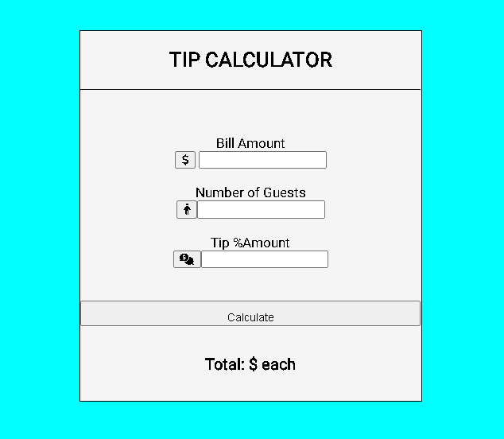
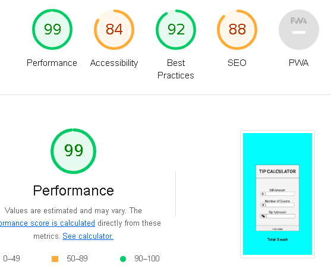

# Tip Calculator

# Functions of the Tip calculator

* The Tip calculator is used to determine how much each person should pay including the tip.
* Only the total amount and the percentage tip should be included for you to calculate the individual amount payable.
* The Tip calculator was created using Javascript, CSS and HTML.

# Accessibility score

# validator testing
## HTML
* No errors were returned when passing through the W3C HTML validator.
##  CSS
* No errors were found in the W3C validator.
## JSHINT
* Some errors were found in the JShint.

# Deployment
## This site was deplyed to github pages
 * From Github repository,navigate to the settings tab
 * From the source dropdown,select main branch
 * From main branch the page will provide the complete website
   
# Credits
## Content
* seanHD
* jproject

## Media
* Icons were taken from fontawsome.
